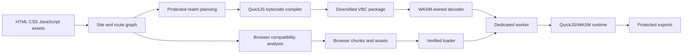
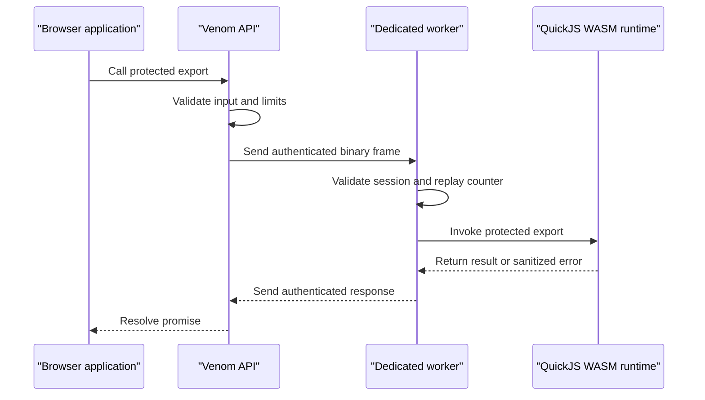

# Venom Secure Web Runtime

<p align="center">
  <strong>Compile ordinary websites into hardened, diversified, QuickJS/WASM-powered static distributions.</strong>
</p>

<p align="center">
  <code>QuickJS bytecode</code> · <code>WebAssembly isolation</code> · <code>Dedicated workers</code> · <code>Hybrid execution</code> · <code>Per-build diversification</code>
</p>

> **Version:** 1.65.4 · **Status:** stable  
> Venom is a hybrid web protection compiler and runtime. It moves valuable JavaScript logic out of ordinary browser source and into a worker-isolated QuickJS/WebAssembly execution environment—while preserving static hosting, browser rendering, routing, assets, and normal frontend code.

---

## Why Venom exists

Client-side applications often contain algorithms, pricing rules, risk models, game engines, signal generation, licensing logic, data transforms, and other valuable implementation details. Minification and obfuscation make that code less pleasant to read, but they still deliver ordinary JavaScript to the browser.

**Venom changes the representation and execution boundary.** Protected logic is compiled into QuickJS bytecode, packaged in a diversified `.vbc` container, decoded through WebAssembly-owned boundaries, and executed inside a dedicated worker-hosted QuickJS/WASM runtime. Browser-facing code receives a narrow asynchronous API instead of direct access to the protected implementation.

Venom does not claim that browser-delivered software can be made permanently secret. Its purpose is to **substantially raise reverse-engineering, extraction, and tampering cost** by forcing analysis across bytecode, WebAssembly, workers, package layout, integrity bindings, and a per-build bridge protocol.

## What makes the runtime advanced

| Capability | Minifier | JS obfuscator | Handwritten WASM | **Venom** |
|---|---:|---:|---:|---:|
| Identifier and syntax reduction | Yes | Yes | N/A | **Yes** |
| Removes protected logic from normal browser JS | No | No | Yes | **Yes** |
| QuickJS bytecode execution | No | No | No | **Built in** |
| Dedicated worker isolation | No | No | Optional | **Built in** |
| WASM-owned package decoding | No | No | Manual | **Built in** |
| Hybrid browser/protected execution | No | No | Difficult | **First-class** |
| Per-build package diversification | No | Limited | Manual | **Automatic** |
| Static-host deployment | Yes | Yes | Usually | **Yes** |
| Fail-closed verified runtime | No | No | Manual | **Yes** |
| Release leak scanning | No | No | Manual | **Integrated** |
| Signed release chain | External | External | External | **Integrated** |

### Protection in layers

1. **Source transformation** — AST minification, mangling, string encoding, and selective control-flow hardening.
2. **Representation change** — protected JavaScript becomes QuickJS bytecode rather than readable browser source.
3. **Runtime isolation** — execution occurs inside QuickJS/WASM hosted by a dedicated worker.
4. **Narrow bridge** — only validated JSON-safe arguments and results cross the public boundary.
5. **Package and bytecode diversification** — section order, identifiers, aliases, offsets, padding, generated assets, and the stored QuickJS record permutation vary by build.
6. **Integrity binding** — loader, runtime, package, stylesheets, and WASM assets are hash-bound.
7. **Release enforcement** — production builds fail closed and run provenance, leakage, hardener, and runtime verification.

## Architecture





Read the deeper architecture guides: [Compiler pipeline](docs/architecture/compiler-pipeline.md), [Protected runtime](docs/architecture/protected-runtime.md), [Trust boundaries](docs/architecture/trust-boundaries.md), and [Package format](docs/package-format.md).

## Five-minute quick start

### 1. Check the environment

```powershell
venom doctor --profile production
```

### 2. Initialize an existing site

```powershell
venom init path\to\site
venom compatibility check path\to\site
```

### 3. Develop with the real protected runtime

```powershell
venom dev path\to\site --open
```

### 4. Build a hardened distribution

```powershell
venom build path\to\site --profile prod --out dist
venom analyze-dist dist
venom release-check dist
```

The result remains a static site that can be served by an ordinary web server or CDN.

## Select what remains in the browser

Venom protects JavaScript by default. Use annotations when compatibility-sensitive code should remain native.

```javascript
// No annotation: protected by default.
function calculateRisk(order) {
  return order.quantity * order.price;
}

// @venom: browser
function renderChart(points) {
  chart.draw(points);
}

// @venom: protected
async function approveOrder(order) {
  return calculateRisk(order) < 100000;
}
```

Browser code calls protected exports asynchronously:

```javascript
await venom.ready();

const approved = await venom.exports.approveOrder({
  symbol: "VENM",
  quantity: 250,
  price: 182.40
});
```

See the complete [annotation guide](docs/guides/annotations.md), [protected function guide](docs/guides/protected-functions.md), and [browser bridge reference](docs/guides/browser-bridge.md).

## Build profiles

Venom deliberately exposes only two profiles.

| Profile | Intended use | Runtime | Output |
|---|---|---|---|
| `dev` | Local development and debugging | Real QuickJS/WASM | Readable generated runtime, stable names, diagnostics |
| `prod` | Deployment | Verified fail-closed QuickJS/WASM | Hashed, hardened, diversified, stripped assets |

Both profiles execute protected code through the real QuickJS/WASM path. Production does not silently fall back to host JavaScript.

## Production distribution

```text
dist/
├── index.html
└── assets/
    ├── app/
    │   ├── app.<hash>.vbc
    │   └── build.json
    ├── images/
    ├── loader/
    │   └── loader.<hash>.js
    ├── runtime/
    │   ├── engine.<hash>.js
    │   ├── r.<hash>.js
    │   ├── runtime.<hash>.wasm
    │   └── rw.<hash>.wasm
    ├── style/
    │   └── s.<hash>.css
    └── workers/
        └── worker.<hash>.js
```

Production output excludes source maps, human-readable extraction reports, browser-test manifests, and contributor-only files. See [production output layout](docs/reference/output-layout.md).

## Build Venom from source

### Windows

Requirements: Visual Studio with Desktop development with C++, CMake 3.20+, Python 3.10+, Node.js 20+, and npm.

```powershell
git clone <repository-url>
cd venom-secure-web-runtime

.\scripts\setup-js-hardener.ps1
.\scripts\build.ps1 -Config Release

.\build\Release\venom.exe doctor --profile production
.\build\Release\venom.exe --version
```

### Linux/macOS

```bash
git clone <repository-url>
cd venom-secure-web-runtime

./scripts/setup-js-hardener.sh
./scripts/build.sh --config Release

./build/venom doctor --profile production
./build/venom --version
```

Runtime contributors rebuilding QuickJS/WASM also need the pinned Emscripten toolchain. Full instructions are in [Building from source](docs/development/building-from-source.md) and [QuickJS/WASM development](docs/development/quickjs-wasm.md).

## Release closure

Venom includes a one-command release validation pipeline.

```powershell
.\scripts\release-closure.ps1
```

It verifies the repository, runtime provenance, JavaScript hardener, clean Release build, complete CTest suite, example builds, production leakage scans, and locally signed release packaging. A successful run ends with:

```text
[venom] RELEASE CLOSURE: PASS
```

See [Release closure](docs/development/release-closure.md).

## Flagship examples

### Protected Chess

A complete chess application with browser-native rendering and protected engine/search logic. It demonstrates isolated exports, worker execution, route/assets handling, and production verification.

[Open the Protected Chess guide](examples/protected-chess/README.md)

### NOVA TRADE

A full trading-terminal demonstration with charts, paper trading, simulated feeds, order workflows, and proprietary risk/signal logic executed through protected QuickJS/WASM exports.

[Open the NOVA TRADE guide](examples/nova-trade/README.md)

### Venom Sentinel Bot Detection

A browser-intelligence dashboard that collects browser-exposed fingerprint, capability, timing, network, and behavior signals in the browser, then sends a JSON-safe assessment payload through Venom's binary capability bridge to a protected QuickJS/WASM scoring engine.

[Open the bot-detection guide](examples/bot-detection/README.md)

## Browser-equivalence evidence

Venom can qualify compatibility by running the same scenario against the original site and the protected production distribution in real Chromium, Firefox, or WebKit sessions. The equivalence gate compares observable DOM values, routes, interactions, console failures, page failures, and optional normalized page snapshots, then binds the report to source, distribution, and manifest hashes.

```powershell
.\scripts\release-closure.ps1 -BrowserRuntimeTests
```

See [browser equivalence testing](docs/compatibility/browser-equivalence.md).

## Documentation

| Goal | Start here |
|---|---|
| Install and build Venom | [Installation](docs/getting-started/installation.md) |
| Protect an existing website | [Existing-site integration](docs/getting-started/existing-project.md) |
| Learn annotations and APIs | [Guides](docs/README.md#use-venom) |
| Understand the architecture | [Architecture overview](docs/architecture/overview.md) |
| Review the security model | [Security model](docs/security/security-model.md) |
| Verify a production release | [Production hardening](docs/security/production-hardening.md) |
| Contribute to the runtime | [Development documentation](docs/README.md#contribute) |
| Find CLI commands | [CLI reference](docs/reference/cli.md) |

## Security model and limitations

Venom is designed to increase the time, specialization, tooling, and per-build effort required to recover or modify protected behavior. It is especially effective against ordinary source inspection, reusable JavaScript deobfuscation workflows, static scraping, and low-effort modification.

It cannot make software permanently secret from an analyst who controls the browser, operating system, memory, and execution environment. Highly motivated analysts can instrument any client runtime given enough time. Sensitive credentials, signing keys, and server-authoritative decisions still belong on a trusted server.

Read [Security model](docs/security/security-model.md), [Threat model](docs/security/threat-model.md), and [Limitations](docs/security/limitations.md). Report vulnerabilities privately through [SECURITY.md](SECURITY.md).

## Repository standards

- [Contributing](CONTRIBUTING.md)
- [Support](SUPPORT.md)
- [Security policy](SECURITY.md)
- [Code of conduct](CODE_OF_CONDUCT.md)
- [Governance](GOVERNANCE.md)
- [Roadmap](ROADMAP.md)
- [Changelog](CHANGES.md)

## License

See [LICENSE](LICENSE) and [NOTICE.md](NOTICE.md).

- [Runtime benchmarking](docs/performance/runtime-benchmarking.md)
