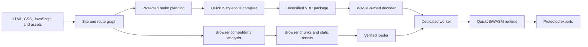
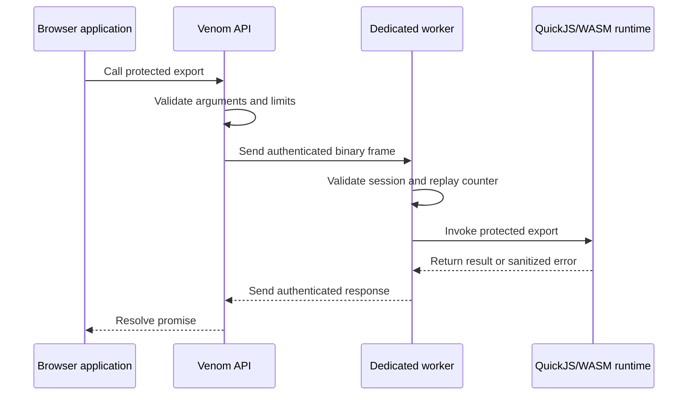

# Venom Secure Web Runtime

<p align="center">
  <strong>Protect high-value browser logic without giving up static hosting.</strong>
</p>

<p align="center">
  Venom compiles selected JavaScript into diversified QuickJS bytecode and executes it inside a dedicated, worker-isolated WebAssembly runtime.
</p>

<p align="center">
  <code>QuickJS bytecode</code> · <code>WebAssembly isolation</code> · <code>Dedicated workers</code> · <code>Hybrid execution</code> · <code>Per-build diversification</code>
</p>

<p align="center">
  <strong>Version 1.65.4</strong> · <strong>Stable</strong> · <strong>Static-host compatible</strong>
</p>

---

## Overview

Venom is a hybrid web-protection compiler and runtime for applications that must ship to the browser but should not expose valuable implementation logic as ordinary JavaScript.

It preserves the parts of the web platform that belong in the browser—HTML, CSS, rendering, routing, assets, and compatibility-sensitive frontend code—while moving selected logic into a dedicated QuickJS/WebAssembly execution environment.

Protected code is:

1. analyzed and separated from browser-native code;
2. compiled into QuickJS bytecode;
3. packaged in a diversified `.vbc` container;
4. decoded through WebAssembly-owned boundaries; and
5. executed inside a dedicated worker-hosted QuickJS/WASM runtime.

Browser code interacts with protected functionality through a narrow asynchronous export API rather than receiving direct access to the original implementation.

> [!IMPORTANT]
> Venom is a reverse-engineering resistance system, not a secrecy guarantee. Any software delivered to a device controlled by an adversary can ultimately be inspected or instrumented. Venom is designed to make extraction, analysis, modification, and reuse substantially more expensive.

## Contents

- [Why Venom](#why-venom)
- [Core capabilities](#core-capabilities)
- [Protection model](#protection-model)
- [Architecture](#architecture)
- [Quick start](#quick-start)
- [Hybrid execution](#hybrid-execution)
- [Build profiles](#build-profiles)
- [Production output](#production-output)
- [Release verification](#release-verification)
- [Browser-equivalence testing](#browser-equivalence-testing)
- [Examples](#examples)
- [Build from source](#build-from-source)
- [Documentation](#documentation)
- [Security model](#security-model)
- [Project resources](#project-resources)
- [License](#license)

## Why Venom

Modern client-side applications often contain logic with meaningful technical or commercial value, including:

- pricing and eligibility rules;
- risk and fraud models;
- game engines and search algorithms;
- signal-generation and ranking logic;
- licensing and entitlement checks;
- proprietary data transformations; and
- domain-specific decision systems.

Minification reduces file size. Obfuscation makes source harder to read. Both still deliver executable JavaScript in a familiar representation to the browser.

Venom changes both the **representation** and the **execution boundary**. An analyst must work across diversified bytecode, WebAssembly, worker isolation, package structure, integrity bindings, runtime protocol behavior, and build-specific transformations instead of beginning with the original JavaScript source.

### Appropriate use cases

Venom is well suited to applications that:

- must remain deployable to a static host or CDN;
- contain client-side logic worth protecting;
- need browser-native rendering and web-platform interoperability;
- benefit from selective rather than all-or-nothing protection; and
- require reproducible production verification.

### What still belongs on a server

Venom does not replace server-side authority. Credentials, private signing keys, authorization decisions, irreversible transactions, and security-critical source-of-truth checks should remain on trusted infrastructure.

## Core capabilities

| Capability | Traditional minification | JavaScript obfuscation | Handwritten WASM | **Venom** |
|---|:---:|:---:|:---:|:---:|
| Identifier and syntax reduction | Yes | Yes | N/A | **Yes** |
| Protected logic removed from ordinary browser JavaScript | No | No | Yes | **Yes** |
| QuickJS bytecode execution | No | No | No | **Built in** |
| Dedicated worker isolation | No | No | Optional | **Built in** |
| WebAssembly-owned package decoding | No | No | Manual | **Built in** |
| Selective browser/protected execution | No | Limited | Manual | **First-class** |
| Per-build package diversification | No | Limited | Manual | **Automatic** |
| Static-host deployment | Yes | Yes | Usually | **Yes** |
| Verified fail-closed production runtime | No | No | Manual | **Built in** |
| Release leakage scanning | No | No | Manual | **Integrated** |
| Signed release packaging workflow | External | External | External | **Integrated** |

## Protection model

Venom combines multiple independent layers. No single layer is treated as sufficient on its own.

1. **Source transformation**  
   AST minification, identifier mangling, string encoding, and selective control-flow hardening reduce readable structure in generated browser-side assets.

2. **Representation change**  
   Protected JavaScript is compiled into QuickJS bytecode instead of being shipped as ordinary source text.

3. **Runtime isolation**  
   Protected execution occurs inside QuickJS/WASM hosted by a dedicated worker, separating it from the page's primary JavaScript realm.

4. **Constrained bridge**  
   Browser code communicates with protected exports through validated, JSON-safe arguments and results rather than unrestricted object access.

5. **Per-build diversification**  
   Package sections, identifiers, aliases, offsets, padding, generated assets, and stored QuickJS record ordering can vary between builds.

6. **Integrity binding**  
   Loader, runtime, package, stylesheet, worker, and WebAssembly assets are bound to expected hashes.

7. **Release enforcement**  
   Production builds use fail-closed runtime behavior and run provenance, hardener, leakage, integrity, and runtime-verification gates.

## Architecture

### Build pipeline



### Runtime call path



For implementation details, see:

- [Compiler pipeline](docs/architecture/compiler-pipeline.md)
- [Protected runtime](docs/architecture/protected-runtime.md)
- [Trust boundaries](docs/architecture/trust-boundaries.md)
- [Package format](docs/package-format.md)

## Quick start

### 1. Verify the production toolchain

```powershell
venom doctor --profile production
```

### 2. Initialize an existing site

```powershell
venom init path\to\site
venom compatibility check path\to\site
```

### 3. Develop against the real protected runtime

```powershell
venom dev path\to\site --open
```

### 4. Build and verify a production distribution

```powershell
venom build path\to\site --profile prod --out dist
venom analyze-dist dist
venom release-check dist
```

The generated application remains a static distribution and can be served by a conventional web server, object store, or CDN.

## Hybrid execution

Venom protects JavaScript by default. Source annotations allow compatibility-sensitive code to remain in the browser while explicitly marking important logic for protected execution.

```javascript
// No annotation: protected by default.
function calculateRisk(order) {
  return order.quantity * order.price;
}

// @venom: browser
function renderChart(points) {
  chart.draw(points);
}

// @venom: protected
async function approveOrder(order) {
  return calculateRisk(order) < 100000;
}
```

Browser-side code calls protected exports asynchronously:

```javascript
await venom.ready();

const approved = await venom.exports.approveOrder({
  symbol: "VENM",
  quantity: 250,
  price: 182.40
});
```

Read the complete guides:

- [Annotations](docs/guides/annotations.md)
- [Protected functions](docs/guides/protected-functions.md)
- [Browser bridge](docs/guides/browser-bridge.md)

## Build profiles

Venom exposes two intentional build profiles.

| Profile | Intended use | Protected runtime | Generated output |
|---|---|---|---|
| `dev` | Local development and diagnostics | Real QuickJS/WASM | Readable generated runtime, stable names, and detailed diagnostics |
| `prod` | Deployment and release qualification | Verified, fail-closed QuickJS/WASM | Hashed, hardened, diversified, and stripped assets |

Both profiles execute protected code through the real QuickJS/WASM path. Production builds do not silently fall back to host JavaScript.

## Production output

A production build emits a static, cache-friendly distribution with stable entry points and content-addressed assets.

```text
dist/
├── index.html
└── assets/
    ├── app/
    │   ├── app.<hash>.vbc
    │   └── build.json
    ├── images/
    ├── loader/
    │   └── loader.<hash>.js
    ├── runtime/
    │   ├── engine.<hash>.js
    │   ├── r.<hash>.js
    │   ├── runtime.<hash>.wasm
    │   └── rw.<hash>.wasm
    ├── style/
    │   └── s.<hash>.css
    └── workers/
        └── worker.<hash>.js
```

Production output excludes source maps, human-readable extraction reports, browser-test manifests, and contributor-only files.

See the [production output layout](docs/reference/output-layout.md) for the complete contract.

## Release verification

Venom includes a one-command release-closure pipeline:

```powershell
.\scripts\release-closure.ps1
```

The pipeline verifies:

- repository state and required project metadata;
- QuickJS/WASM runtime provenance;
- JavaScript hardener availability;
- a clean Release build;
- the complete CTest suite;
- flagship example builds;
- production leakage and integrity checks; and
- locally signed release packaging.

A successful run ends with:

```text
[venom] RELEASE CLOSURE: PASS
```

See [Release closure](docs/development/release-closure.md).

## Browser-equivalence testing

Venom can compare an original site with its protected production distribution in real Chromium, Firefox, or WebKit sessions.

The equivalence gate can evaluate:

- observable DOM values;
- routes and navigation behavior;
- user interactions;
- console and page failures;
- optional normalized page snapshots; and
- source, distribution, and manifest hash bindings.

Run browser qualification as part of release closure:

```powershell
.\scripts\release-closure.ps1 -BrowserRuntimeTests
```

See [Browser equivalence testing](docs/compatibility/browser-equivalence.md).

## Examples

### Protected Chess

A complete chess application with browser-native rendering and protected engine/search logic. It demonstrates isolated exports, worker execution, route and asset handling, and production verification.

[Explore Protected Chess](examples/protected-chess/README.md)

### NOVA TRADE

A full trading-terminal demonstration with charts, paper trading, simulated feeds, order workflows, and proprietary risk and signal logic executed through protected QuickJS/WASM exports.

[Explore NOVA TRADE](examples/nova-trade/README.md)

### Venom Sentinel Bot Detection

A browser-intelligence dashboard that collects browser-exposed fingerprint, capability, timing, network, and behavior signals, then submits a JSON-safe assessment payload through Venom's binary capability bridge to a protected QuickJS/WASM scoring engine.

[Explore Venom Sentinel](examples/bot-detection/README.md)

## Build from source

### Windows

**Requirements**

- Visual Studio with **Desktop development with C++**
- CMake 3.20 or newer
- Python 3.10 or newer
- Node.js 20 or newer
- npm

```powershell
git clone <repository-url>
cd venom-secure-web-runtime

.\scripts\setup-js-hardener.ps1
.\scripts\build.ps1 -Config Release

.\build\Release\venom.exe doctor --profile production
.\build\Release\venom.exe --version
```

### Linux and macOS

```bash
git clone <repository-url>
cd venom-secure-web-runtime

./scripts/setup-js-hardener.sh
./scripts/build.sh --config Release

./build/venom doctor --profile production
./build/venom --version
```

Contributors who rebuild the QuickJS/WASM runtime also need the pinned Emscripten toolchain.

Detailed setup documentation:

- [Building from source](docs/development/building-from-source.md)
- [QuickJS/WASM development](docs/development/quickjs-wasm.md)

## Documentation

| Goal | Start here |
|---|---|
| Install and build Venom | [Installation](docs/getting-started/installation.md) |
| Protect an existing website | [Existing-site integration](docs/getting-started/existing-project.md) |
| Learn annotations and public APIs | [Guides](docs/README.md#use-venom) |
| Understand the architecture | [Architecture overview](docs/architecture/overview.md) |
| Review the security model | [Security model](docs/security/security-model.md) |
| Verify a production release | [Production hardening](docs/security/production-hardening.md) |
| Measure runtime performance | [Runtime benchmarking](docs/performance/runtime-benchmarking.md) |
| Contribute to the runtime | [Development documentation](docs/README.md#contribute) |
| Find CLI commands and options | [CLI reference](docs/reference/cli.md) |

## Security model

Venom is designed to increase the time, specialization, tooling, and per-build effort required to recover or alter protected behavior.

It is particularly effective against:

- ordinary browser source inspection;
- reusable JavaScript deobfuscation workflows;
- static source scraping;
- low-effort code modification; and
- direct reuse of protected implementation logic.

Venom cannot make browser-delivered software permanently secret from an analyst who controls the browser, operating system, memory, and execution environment. A sufficiently motivated analyst can instrument any client runtime given enough time and resources.

For the complete security position, read:

- [Security model](docs/security/security-model.md)
- [Threat model](docs/security/threat-model.md)
- [Limitations](docs/security/limitations.md)

Report suspected vulnerabilities privately through [SECURITY.md](SECURITY.md). Do not disclose unpatched security issues in public discussions or issue trackers.

## Project resources

| Resource | Purpose |
|---|---|
| [CONTRIBUTING.md](CONTRIBUTING.md) | Contribution workflow and engineering standards |
| [SUPPORT.md](SUPPORT.md) | Support channels and usage guidance |
| [SECURITY.md](SECURITY.md) | Vulnerability reporting policy |
| [CODE_OF_CONDUCT.md](CODE_OF_CONDUCT.md) | Community expectations |
| [GOVERNANCE.md](GOVERNANCE.md) | Project governance and decision-making |
| [ROADMAP.md](ROADMAP.md) | Planned development direction |
| [CHANGES.md](CHANGES.md) | Release history and notable changes |

## License

See [LICENSE](LICENSE) and [NOTICE.md](NOTICE.md) for licensing terms and third-party notices.
