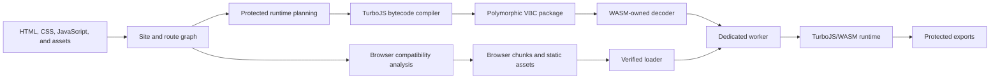
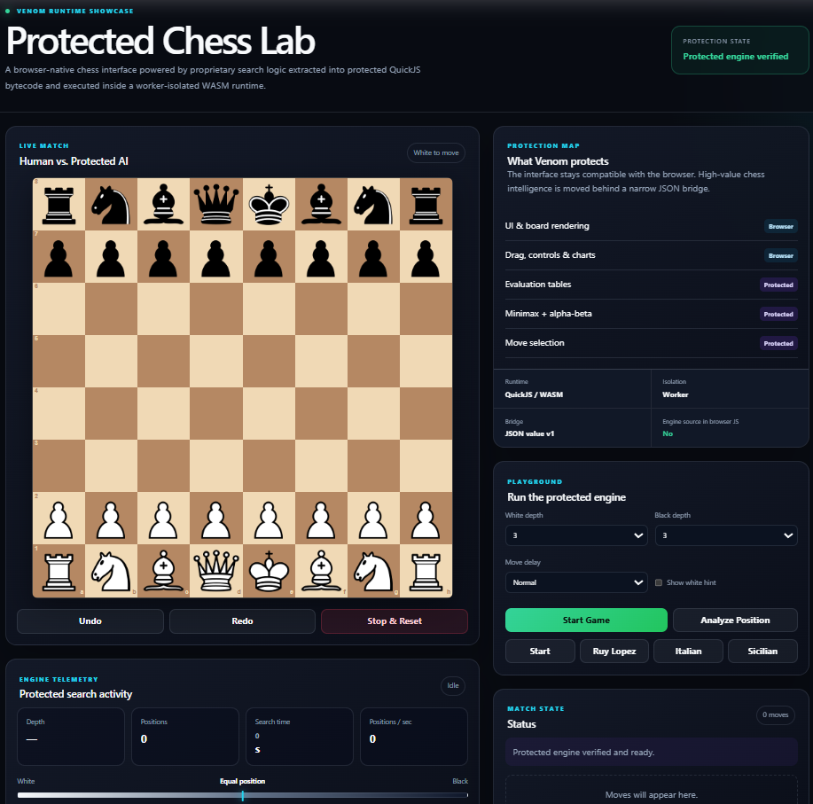
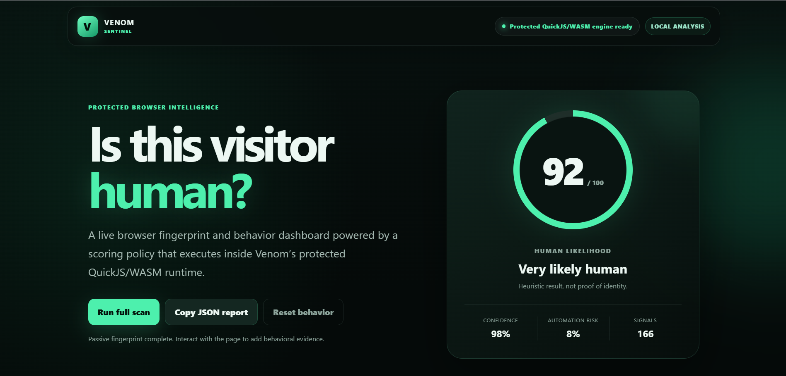
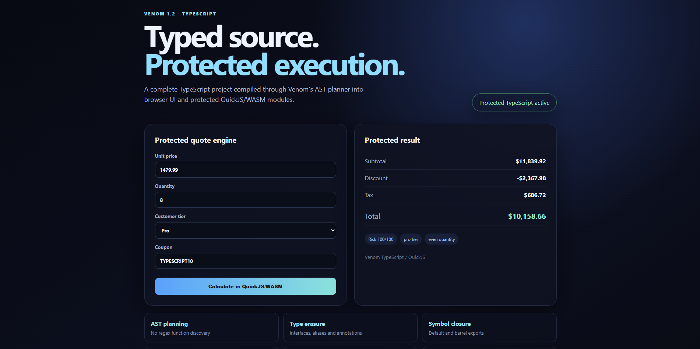
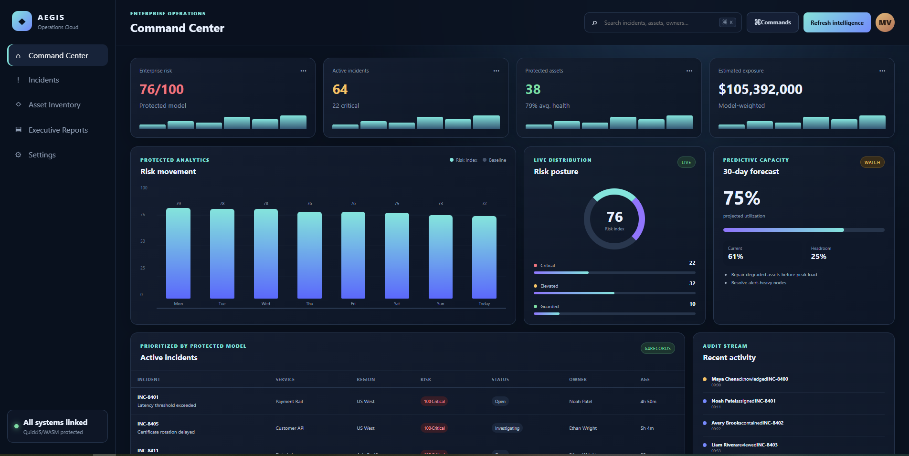

# Venom Secure Web Runtime

<p align="center">
  <strong>Protect high-value browser logic without giving up static hosting.</strong>
</p>

<p align="center">
  Venom compiles selected JavaScript and TypeScript into TurboJS bytecode, packages it in build-specific protected records, and executes it inside a dedicated worker-hosted WebAssembly runtime.
</p>

<p align="center">
  <code>TurboJS bytecode</code> · <code>Typed runtime SDK</code> · <code>Polymorphic builds</code> · <code>WebAssembly isolation</code> · <code>Fail-closed releases</code>
</p>

<p align="center">
  <strong>Version 3.0.0</strong> · <strong>Static-host compatible</strong>
</p>

---

## Venom 3.0

Venom 3.0 expands the protected web compiler into a broader application toolchain while keeping the same static-host-friendly, fail-closed deployment model.

- **TurboJS integration:** protected JavaScript and TypeScript compile into TurboJS bytecode and execute through the embedded TurboJS/WebAssembly runtime, with synchronized ABI contracts, runtime verification, protected package fingerprints, and optimized Map/Set execution.
- **React compatibility:** React and TSX projects are supported through production Vite-output ingestion, the `@venom/react` hooks package, protected export calls, runtime readiness handling, and a tested React + Vite showcase.
- **Zero-config integration:** `@venom/venom` detects common project types, runs existing framework builds, discovers their output, and creates a protected distribution with the single `venom` command.
- **Modern framework support:** first-party workflows cover React, Vite, Vue, Svelte, TypeScript, static websites, and Manifest V3 Chrome extensions without requiring an application rewrite.
- **Chrome extension protection:** extension pages retain the normal Venom protected-site layout while generated Chrome adapters bridge DOM and `chrome.*` APIs to protected TurboJS exports.
- **Developer workflow:** guided initialization, project-local compiler setup, toolchain locking, diagnostics, binary discovery, and `venom dev` provide reproducible local and continuous protected builds.
- **Production hardening:** process-isolated JavaScript hardening, race-safe integrity-checked caches, polymorphic VBC packaging, protected-source leak scanning, package verification, and fail-closed runtime enforcement remain integrated into release builds.

## React and Vite

Venom supports React applications through `@venom/vite`. Vite remains responsible for JSX/TSX, React transforms, package resolution, CSS, and chunk generation. During a production build, the Venom plugin detects React and protects Vite's completed `dist` output instead of attempting to compile raw TSX.

```js
import react from "@vitejs/plugin-react";
import venom from "@venom/vite";

export default {
  plugins: [react(), venom({ outDir: "dist-venom" })]
};
```

See `examples/react-vite-showcase`.

## Overview

Venom is a hybrid web-protection compiler and runtime for applications that must ship to the browser but should not expose valuable implementation logic as ordinary JavaScript.

It preserves the parts of the web platform that belong in the browser—HTML, CSS, rendering, routing, assets, and compatibility-sensitive frontend code—while moving selected logic into a dedicated TurboJS/WebAssembly execution environment.

Protected code is:

1. analyzed and separated from browser-native code;
2. compiled into TurboJS bytecode;
3. wrapped in build-specific bytecode envelopes and packaged in a polymorphic `.vbc` container;
4. decoded through WebAssembly-owned boundaries; and
5. executed inside a dedicated worker-hosted TurboJS/WASM runtime.

Browser code interacts with protected functionality through a narrow asynchronous export API rather than receiving direct access to the original implementation.

> [!IMPORTANT]
> Venom is a reverse-engineering resistance system, not a secrecy guarantee. Any software delivered to a device controlled by an adversary can ultimately be inspected or instrumented. Venom is designed to make extraction, analysis, modification, and reuse substantially more expensive.

## Why a Venom distribution is difficult to reverse

A production Venom distribution is not merely minified JavaScript. It changes the representation, packaging, execution boundary, and runtime protocol of protected code.

> [!NOTE]
> The exact original protected source is not present in `dist/` and cannot be recovered byte-for-byte from the distribution. Original comments, formatting, source maps, module text, and most source-level identifiers are not shipped. A determined analyst can still instrument the browser, observe decoded bytecode or behavior, and reconstruct equivalent logic. Venom raises that cost substantially; it does not claim permanent client-side secrecy.

### Protection strengths

| Layer | What Venom does | Why it matters |
|---|---|---|
| **Original-source removal** | Protected JavaScript is compiled into TurboJS bytecode. Production output excludes protected source text, source maps, extraction reports, and internal engineering metadata. | Ordinary source inspection and source-oriented deobfuscation do not begin with the original implementation. |
| **Heavily hardened distribution JavaScript** | Generated loader, runtime, engine, and worker assets are minified and mangled with Terser, then role-specifically obfuscated with encoded string arrays, hexadecimal identifiers, string splitting, control-flow transformation, dead-code injection, and self-defending output where compatible. | The remaining browser-visible glue is substantially harder to read, patch, and reuse than a normal production bundle. |
| **Polymorphic builds** | Production builds vary package layout, padding, section ordering, identifiers, aliases, string and route ordering, host-call classes, DOM command identifiers, Route VM instruction-field layout, XOR masks, and physical opcode mappings. | Two builds of the same application can have different binary structure while preserving behavior, reducing the value of fixed offsets and one-build tooling. |
| **Polymorphic Route VM opcodes** | Logical route instructions are translated to build-specific physical opcodes, masks, operand ordering, and DOM command layouts. | Static Route VM decoders must recover the mapping for the exact build instead of relying on one universal opcode table. |
| **Build-specific TurboJS envelopes** | Canonical TurboJS records are stored inside `VTJSE006` envelopes with build/route/source/order binding, a per-build 16-lane byte permutation, stream transformation, ABI fingerprinting, and inner-record integrity validation. | Raw canonical TurboJS bytecode signatures are not directly present in package script sections, and a decoder from one build does not automatically work on another. |
| **WASM-owned streamed decoding** | The package is uploaded to resident WebAssembly storage in validated chunks, JavaScript's fetched package copy is cleared, sections are materialized lazily, and temporary decoded buffers are erased at the earliest safe point. | Full-package and plaintext interception windows are narrower and decoding logic stays behind the WASM runtime boundary. |
| **Bounds-checked memory handling** | Bridge and bytecode memory access uses centralized pointer/length validation, overflow checks, short-lived views, explicit zeroization, and allocation retirement. | This reduces accidental plaintext retention and makes unsafe memory ranges fail closed. WebAssembly memory remains inspectable to a browser owner. |
| **Private binary capability bridge** | Protected calls travel over a private `MessagePort` as transferable binary frames with opaque capabilities, generation binding, monotonic counters, integrity tags, rotated session opcodes, and single-use capability leases. | Protected function names are not sent over the transport; stale, replayed, malformed, cross-session, or unknown-capability frames are rejected. |
| **Worker isolation and split trust domains** | Package decoding and TurboJS execution have separate responsibilities, and decoded records carry route/source/order/content-bound handoff records that the execution domain independently validates. | Substituting or redirecting decoded code requires preserving both the bytes and their exact execution context. |
| **Runtime integrity seals** | The worker seals capability tables, registry bytecode, and bridge opcodes; the browser runtime seals release policy, ABI identity, and route mapping state and rechecks them at execution boundaries. | Casual table mutation or protocol patching does not continue silently. |
| **Asset binding and fail-closed verification** | Loader, package, worker, runtime JavaScript, stylesheets, and WASM artifacts are hash-bound and checked by release tooling. Missing, stale, mismatched, or tampered production components stop execution. | A production build does not silently downgrade to readable host-JavaScript execution. |
| **Release leakage and provenance gates** | Production qualification scans for source/debug markers, readable internal names, raw runtime records, source maps, stale ABI metadata, missing hardener output, and runtime provenance mismatches. | Security properties are enforced as build and release contracts instead of relying only on developer discipline. |

Venom uses **polymorphic** as the product-level term because multiple physical representations are generated for equivalent behavior. Internally, some components and APIs retain the word *diversification* for the deterministic generation process. Venom does not claim to renumber upstream TurboJS interpreter opcodes; it polymorphically transforms the stored TurboJS record and uses truly polymorphic physical opcodes for its own Route VM.

For the implementation-level review, see [Protection strengths and evidence](docs/security/protection-strengths.md).

## Contents

- [Why a Venom distribution is difficult to reverse](#why-a-venom-distribution-is-difficult-to-reverse)
- [Why Venom](#why-venom)
- [Core capabilities](#core-capabilities)
- [Protection model](#protection-model)
- [Architecture](#architecture)
- [Quick start](#quick-start)
- [Hybrid execution](#hybrid-execution)
- [Build profiles](#build-profiles)
- [Production output](#production-output)
- [Release verification](#release-verification)
- [Browser-equivalence testing](#browser-equivalence-testing)
- [Examples](#examples)
- [Build from source](#build-from-source)
- [Documentation](#documentation)
- [Security model](#security-model)
- [Project resources](#project-resources)
- [License](#license)

## Why Venom

Modern client-side applications often contain logic with meaningful technical or commercial value, including:

- pricing and eligibility rules;
- risk and fraud models;
- game engines and search algorithms;
- signal-generation and ranking logic;
- licensing and entitlement checks;
- proprietary data transformations; and
- domain-specific decision systems.

Minification reduces file size. Obfuscation makes source harder to read. Both still deliver executable JavaScript in a familiar representation to the browser.

Venom changes both the **representation** and the **execution boundary**. An analyst must work across polymorphic bytecode envelopes, WebAssembly, worker isolation, package structure, integrity bindings, runtime protocol behavior, and build-specific transformations instead of beginning with the original JavaScript source.

### Appropriate use cases

Venom is well suited to applications that:

- must remain deployable to a static host or CDN;
- contain client-side logic worth protecting;
- need browser-native rendering and web-platform interoperability;
- benefit from selective rather than all-or-nothing protection; and
- require reproducible production verification.

### What still belongs on a server

Venom does not replace server-side authority. Credentials, private signing keys, authorization decisions, irreversible transactions, and security-critical source-of-truth checks should remain on trusted infrastructure.

## Core capabilities

| Capability | Traditional minification | JavaScript obfuscation | Handwritten WASM | **Venom** |
|---|:---:|:---:|:---:|:---:|
| Identifier and syntax reduction | Yes | Yes | N/A | **Yes** |
| Protected logic removed from ordinary browser JavaScript | No | No | Yes | **Yes** |
| TurboJS bytecode execution | No | No | No | **Built in** |
| Dedicated worker isolation | No | No | Optional | **Built in** |
| WebAssembly-owned package decoding | No | No | Manual | **Built in** |
| Selective browser/protected execution | No | Limited | Manual | **First-class** |
| Native TypeScript input | No | No | Manual | **Built in** |
| Per-build polymorphic packaging and Route VM encoding | No | Limited | Manual | **Automatic** |
| Static-host deployment | Yes | Yes | Usually | **Yes** |
| Verified fail-closed production runtime | No | No | Manual | **Built in** |
| Release leakage scanning | No | No | Manual | **Integrated** |
| Signed release packaging workflow | External | External | External | **Integrated** |

## Protection model

Venom combines multiple independent layers. No single layer is treated as sufficient on its own.

1. **Source transformation**  
   AST minification, identifier mangling, string encoding, and selective control-flow hardening reduce readable structure in generated browser-side assets.

2. **Representation change**  
   Protected JavaScript is compiled into TurboJS bytecode instead of being shipped as ordinary source text.

3. **Runtime isolation**  
   Protected execution occurs inside TurboJS/WASM hosted by a dedicated worker, separating it from the page's primary JavaScript runtime.

4. **Constrained bridge**  
   Browser code communicates with protected exports through validated, JSON-safe arguments and results rather than unrestricted object access.

5. **Polymorphic builds**  
   Package layout, physical Route VM opcodes, instruction fields, masks, identifiers, aliases, padding, generated assets, and stored TurboJS record representation can vary between builds.

6. **Integrity binding**  
   Loader, runtime, package, stylesheet, worker, and WebAssembly assets are bound to expected hashes.

7. **Release enforcement**  
   Production builds use fail-closed runtime behavior and run provenance, hardener, leakage, integrity, and runtime-verification gates.

## Architecture

### Build pipeline



### Runtime call path


For implementation details, see:

- [Compiler pipeline](docs/architecture/compiler-pipeline.md)
- [Protected runtime](docs/architecture/protected-runtime.md)
- [Trust boundaries](docs/architecture/trust-boundaries.md)
- [Package format](docs/architecture/package-format.md)

## Quick start

### 1. Verify the production toolchain

```powershell
venom doctor --profile production
```

### 2. Initialize an existing site

```powershell
venom init path\to\site
venom compatibility check path\to\site
```

### 3. Develop against the real protected runtime

```powershell
venom dev path\to\site --open
```

### 4. Build and verify a production distribution

```powershell
venom build path\to\site --profile prod --out dist
venom analyze dist
venom verify dist
```

The generated application remains a static distribution and can be served by a conventional web server, object store, or CDN.

### Build progress output

Protected builds print structured progress by default. Each phase identifies the work being performed and reports the elapsed time of the preceding phase, making long production builds easier to diagnose.

```powershell
venom build . --profile prod --out dist
venom build . --profile prod --out dist --verbose
venom build . --profile prod --out dist --quiet
```

- Default output shows major compiler phases, artifact counts, timings, and the final protection report.
- `--verbose` (`-v`) adds planner, module-graph, polymorphism, runtime, and package details.
- `--quiet` (`-q`) emits only errors and the final output location.
- `--format json` remains machine-readable and never mixes human progress lines into JSON output.
- Production builds use a content-addressed compiler cache for embedded JavaScript hardening and native TurboJS bytecode by default. Use `--no-cache` for a clean diagnostic build or `--cache-dir <path>` to relocate it.

## Hybrid execution

Venom protects JavaScript by default. Source annotations allow compatibility-sensitive code to remain in the browser while explicitly marking important logic for protected execution.

```javascript
// No annotation: protected by default.
function calculateRisk(order) {
  return order.quantity * order.price;
}

// @venom: browser
function renderChart(points) {
  chart.draw(points);
}

// @venom: protected
async function approveOrder(order) {
  return calculateRisk(order) < 100000;
}
```

Browser-side code calls protected exports asynchronously:

```javascript
await venom.ready();

const approved = await venom.exports.approveOrder({
  symbol: "VENM",
  quantity: 250,
  price: 182.40
});
```

Read the complete guides:

- [Annotations](docs/guides/annotations.md)
- [Protected functions](docs/guides/protected-functions.md)
- [TypeScript input](docs/guides/typescript.md)
- [Typed bridge contracts](docs/guides/typed-bridge-contracts.md)
- [Browser bridge](docs/guides/browser-bridge.md)

## Build profiles

Venom exposes two intentional build profiles.

| Profile | Intended use | Protected runtime | Generated output |
|---|---|---|---|
| `dev` | Local development and diagnostics | Real TurboJS/WASM | Readable generated runtime, stable names, and detailed diagnostics |
| `prod` | Deployment and release qualification | Verified, fail-closed TurboJS/WASM | Hashed, hardened, polymorphic, and stripped assets |

Both profiles execute protected code through the real TurboJS/WASM path. Production builds do not silently fall back to host JavaScript.

## Production output

A production build emits a static, cache-friendly distribution with stable entry points and content-addressed assets.

```text
dist/
├── index.html
└── assets/
    ├── app/
    │   ├── <hash>.vbc
    │   └── <hash>.css
    ├── images/
    ├── javascript/
    │   └── <hash>.js
    └── wasm/
        └── <hash>.wasm
```

Production output excludes source maps, human-readable extraction reports,
browser-test manifests, internal engineering files, and every unreferenced input
file. Public assets are selected from the reachable HTML, CSS, and planned
JavaScript graph; the compiler rejects a distribution whose final file set differs
from that plan.

See the [production output layout](docs/reference/output-layout.md) for the complete contract.

## Release verification

Venom includes a one-command release-closure pipeline:

```powershell
.\scripts\windows\release-closure.ps1
```

The pipeline verifies:

- repository state and required project metadata;
- TurboJS/WASM runtime provenance;
- JavaScript hardener availability;
- a clean Release build;
- the complete CTest suite;
- flagship example builds;
- production leakage and integrity checks; and
- locally signed release packaging.

A successful run ends with:

```text
[venom] RELEASE CLOSURE: PASS
```

See [Release closure](docs/operations/release-verification.md).

## Browser-equivalence testing

Venom can compare an original site with its protected production distribution in real Chromium, Firefox, or WebKit sessions.

The equivalence gate can evaluate:

- observable DOM values;
- routes and navigation behavior;
- user interactions;
- console and page failures;
- optional normalized page snapshots; and
- source, distribution, and manifest hash bindings.

Run browser qualification as part of release closure:

```powershell
.\scripts\windows\release-closure.ps1 
```

See [Browser equivalence testing](docs/operations/browser-equivalence.md).

## Examples

### Protected Chess



A complete chess application with browser-native rendering and protected engine/search logic. It demonstrates isolated exports, worker execution, route and asset handling, and production verification.

[Explore Protected Chess](examples/protected-chess/README.md)

### NOVA TRADE


A full trading-terminal demonstration with charts, paper trading, simulated feeds, order workflows, and proprietary risk and signal logic executed through protected TurboJS/WASM exports.

[Explore NOVA TRADE](examples/nova-trade/README.md)

### Venom Sentinel Bot Detection



A browser-intelligence dashboard that collects browser-exposed fingerprint, capability, timing, network, and behavior signals, then submits a JSON-safe assessment payload through Venom's binary capability bridge to a protected TurboJS/WASM scoring engine.

[Explore Venom Sentinel](examples/bot-detection/README.md)

### TypeScript AST Showcase


- `examples/tsx-showcase` — typed TSX UI calling protected TypeScript through TurboJS/WASM.
- `examples/javascript-playground` — development-mode JavaScript compiler and execution playground powered directly by TurboJS/WASM.

A complete typed application demonstrating AST-backed runtime planning, TypeScript erasure, symbol-level module closure, protected TurboJS/WASM execution, browser-module linking, and non-JavaScript `<script>` data handling.

[Explore the TypeScript AST Showcase](examples/typescript-showcase/README.md)

## Build from source

### Windows

**Requirements**

- Visual Studio with **Desktop development with C++**
- CMake 3.20 or newer
- Python 3.10 or newer

```powershell
git clone https://github.com/Ascension-Digital-Technologies/Venom.git
cd Venom

.\scripts\windows\build.ps1 -Config Release

.\build\Release\venom.exe doctor --profile production
.\build\Release\venom.exe --version
```

Windows `.bat` launchers remain open after both success and failure when double-clicked, so the final status is always visible. Set `VENOM_NO_PAUSE=1` for automation or terminal workflows that should return immediately.

### Linux and macOS

```bash
git clone https://github.com/Ascension-Digital-Technologies/Venom.git
cd Venom

bash scripts/linux/build.sh --config Release

./build/venom doctor --profile production
./build/venom --version
```

Normal production builds use the embedded verified runtime and do not require Emscripten. The pinned Emscripten toolchain is needed only when rebuilding the bundled TurboJS/WASM artifact.

Detailed setup documentation:

- [Building from source](docs/getting-started/build-from-source.md)
- [Production build profiles](docs/operations/build-profiles.md)

## Documentation

- [TypeScript compatibility](docs/reference/typescript-compatibility.md)

| Goal | Start here |
|---|---|
| Install and build Venom | [Installation](docs/getting-started/installation.md) |
| Protect an existing website | [Existing-site integration](docs/getting-started/existing-project.md) |
| Learn annotations and public APIs | [Guides](docs/README.md#integrate-venom) |
| Understand the architecture | [Architecture overview](docs/architecture/overview.md) |
| Review the security model | [Security model](docs/security/security-model.md) |
| Verify a production release | [Production hardening](docs/security/production-hardening.md) |
| Measure runtime performance | [Runtime benchmarking](docs/operations/runtime-performance.md) |
| Contribute to the runtime | [Contribution guide](CONTRIBUTING.md) |
| Find CLI commands and options | [CLI reference](docs/reference/cli.md) |

## Security model

Venom is designed to increase the time, specialization, tooling, and per-build effort required to recover or alter protected behavior.

It is particularly effective against:

- ordinary browser source inspection;
- reusable JavaScript deobfuscation workflows;
- static source scraping;
- low-effort code modification; and
- direct reuse of protected implementation logic.

Venom cannot make browser-delivered software permanently secret from an analyst who controls the browser, operating system, memory, and execution environment. A sufficiently motivated analyst can instrument any client runtime given enough time and resources.

For the complete security position, read:

- [Security model](docs/security/security-model.md)
- [Threat model](docs/security/threat-model.md)
- [Limitations](docs/security/limitations.md)

Report suspected vulnerabilities privately through [SECURITY.md](SECURITY.md). Do not disclose unpatched security issues in public discussions or issue trackers.

## Project resources

| Resource | Purpose |
|---|---|
| [Documentation hub](docs/README.md) | Complete production installation, integration, security, operations, and reference documentation |
| [SUPPORT.md](SUPPORT.md) | Supported usage, diagnostics, and assistance guidance |
| [SECURITY.md](SECURITY.md) | Private vulnerability reporting policy |
| [CHANGES.md](CHANGES.md) | Public release history |
| [CONTRIBUTING.md](CONTRIBUTING.md) | Development workflow, review expectations, and documentation standards |
| [CODE_OF_CONDUCT.md](CODE_OF_CONDUCT.md) | Community participation and enforcement standards |

## Versioning

Venom follows [Semantic Versioning](docs/operations/versioning.md). The current public release is **1.2.3**. Internal commits and CI runs do not create new public version numbers.

## License

See [LICENSE](LICENSE) and [NOTICE.md](NOTICE.md) for licensing terms and third-party notices.

> **Verified WASM toolchain:** Venom pins Emscripten 4.0.10 for reproducible release builds. The minimal TurboJS/WASM target excludes TurboJS POSIX libc helpers, allowing newer Emscripten releases to compile the web/worker runtime without `environ` or `sighandler_t` compatibility failures.

### Aegis Operations enterprise stress test

A 40-file TypeScript/TSX operations dashboard with five protected TurboJS/WASM analytics services, deep browser module linking, interactive views, and production verification. Run `./scripts/linux/build-and-launch-aegis-operations.sh` or `.\scripts\windows\build-and-launch-aegis-operations.bat`.


## Aegis Operations Screenshot



## Runtime ABI qualification

Venom's embedded TurboJS/WASM runtime is governed by `contracts/turbojs-wasm-abi.json`. Native builds parse the actual embedded WebAssembly export section before packaging. The generated browser engine consumes the same required-export and toolchain-export sets. Playwright qualification covers the JavaScript Playground and Aegis Operations in Chromium on normal CI runs and Chromium, Firefox, and WebKit during nightly qualification.

### Chrome Manifest V3

Venom can emit load-unpacked Chrome extensions with protected extension-page routes and a TurboJS/WASM-compatible extension CSP. See `examples/chrome-extension`, `docs/guides/chrome-extensions.md`, and `scripts/windows/build-and-launch-chrome-extension.bat`.

## Zero-config project integration

Existing projects can add Venom without restructuring their application:

```bash
npm install --save-dev @venom/venom
npx venom
npx venom dev
```

Venom detects static websites, Chrome extensions, Vite, React, Vue, and Svelte projects. Framework projects run their existing production build first, and Venom protects the compiled browser output. Framework-specific packages remain optional for applications that need direct protected calls or build-status APIs.

See `docs/guides/zero-config-integration.md` for overrides and deployment details. Venom can be project-local; use `npx venom bin` to inspect the compiler selected by automatic discovery.
