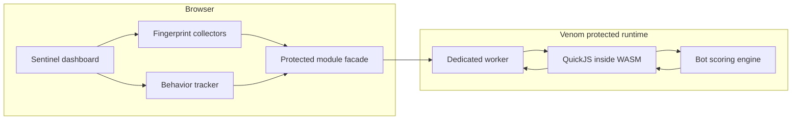
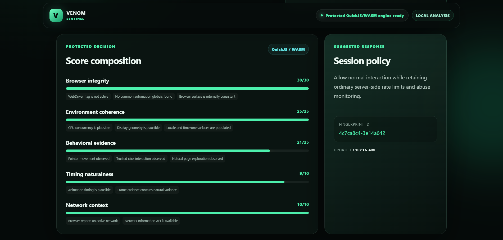
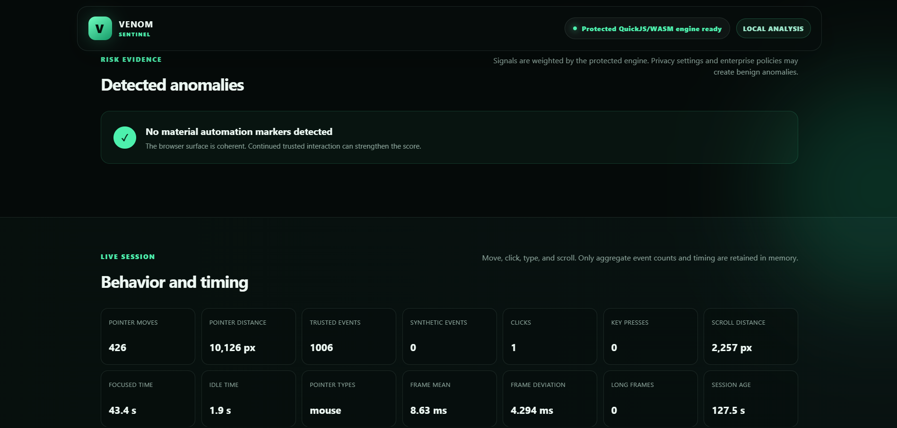
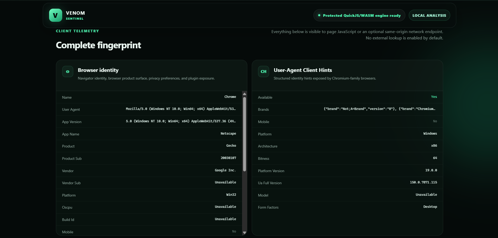
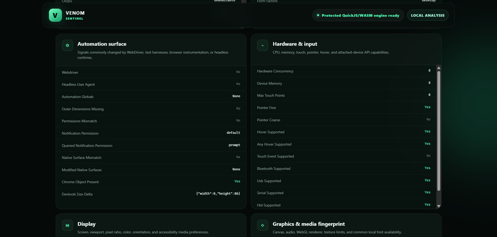
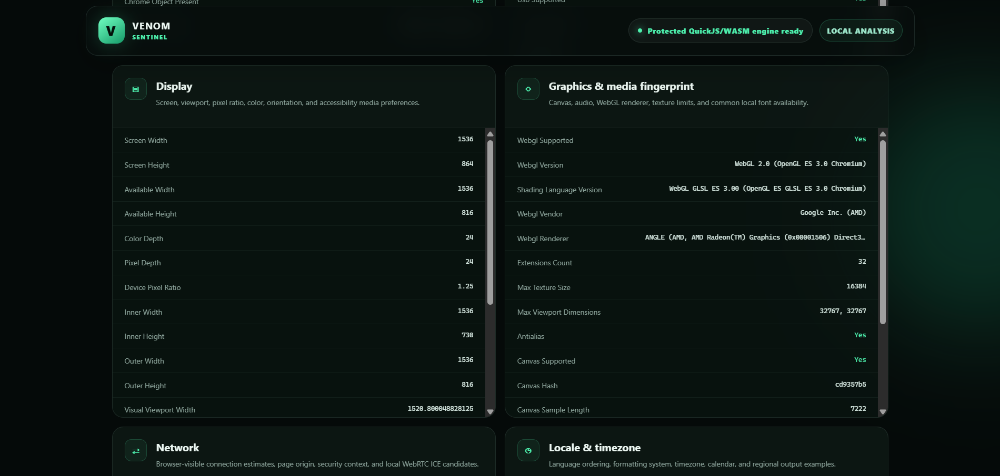

# Venom Sentinel — Protected Bot Detection


Venom Sentinel is a browser-fingerprint and behavioral-analysis example whose scoring policy executes inside Venom's protected QuickJS/WASM runtime.

The page inventories browser-exposed client information, observes aggregate trusted interaction, and produces a live **human-likelihood score from 1 to 100**. The user interface and signal collection remain browser-native; the weighting, anomaly classification, score composition, and response recommendation are protected.

> This is a defensive demonstration, not an identity verifier. Production bot defense should combine client evidence with server-observed request history, reputation, rate limits, account context, and challenge flows.

## What the example demonstrates

- selective protection of proprietary detection logic;
- a narrow browser-to-protected-module boundary;
- live passive and behavioral signal assessment;
- browser, user-agent, hardware, display, locale, graphics, audio, canvas, storage, permission, media-device, and network telemetry;
- WebDriver, headless-user-agent, automation-global, API-surface, permission, and environment-consistency checks;
- human-likelihood, automation-risk, confidence, category, finding, and policy outputs;
- no required third-party library or external network lookup;
- production fail-closed QuickJS/WASM execution.

## Protection boundary



### Browser-native code

- DOM rendering and responsive interface;
- browser and user-agent collection;
- canvas, audio, WebGL, font, storage, and permission probes;
- Network Information API and local WebRTC candidate collection;
- aggregate pointer, click, keyboard, scroll, focus, visibility, and frame-timing observations;
- JSON report rendering and clipboard export.

### Protected code

- signal validation and normalization;
- anomaly weights and deductions;
- browser-integrity score;
- environment-coherence score;
- behavior-evidence score;
- timing-naturalness score;
- network-context score;
- final 1–100 human-likelihood score;
- confidence estimate, classification, findings, and recommended response policy;
- deterministic fingerprint identifier derivation.

## Interface gallery

### Protected score composition



### Behavior and anomaly analysis



### Browser identity and client hints



### Automation and hardware surfaces



### Display and graphics fingerprint



## Source layout

```text
examples/bot-detection/
├── index.html
├── assets/
│   ├── css/
│   │   └── main.css
│   └── js/
│       ├── app.js
│       └── fingerprint.js
├── protected/
│   └── bot-engine.js
├── README.md
├── venom.browser.json
└── venom.lock
```

The browser adapter calls the stable protected bridge directly:

```javascript
await venom.ready();

const decision = await venom.call("assessClient", {
  browser,
  automation,
  hardware,
  display,
  graphics,
  locale,
  network,
  behavior,
  timing,
  session
});
```

The compiler removes the protected implementation from readable browser source and registers `assessClient` inside the QuickJS/WASM runtime. Calling the bridge directly also avoids browser-relative module resolution from Venom's packaged `blob:` execution URLs.

## Result shape

```javascript
{
  humanScore: 91,
  automationRisk: 9,
  classification: "Very likely human",
  confidence: 87,
  fingerprintId: "7c28e181-1a92cf87",
  categories: [
    { id: "integrity", label: "Browser integrity", score: 30, max: 30 },
    { id: "coherence", label: "Environment coherence", score: 25, max: 25 },
    { id: "behavior", label: "Behavioral evidence", score: 19, max: 25 },
    { id: "timing", label: "Timing naturalness", score: 8, max: 10 },
    { id: "network", label: "Network context", score: 9, max: 10 }
  ],
  findings: [],
  recommendation: "Allow normal interaction while retaining ordinary server-side rate limits and abuse monitoring."
}
```

## Score interpretation

| Score | Classification | Suggested demo policy |
|---:|---|---|
| 86–100 | Very likely human | Normal access with ordinary abuse monitoring |
| 72–85 | Likely human | Normal access; re-check sensitive actions |
| 52–71 | Uncertain | Allow low-risk browsing; verify sensitive actions |
| 30–51 | Likely automated | Add a low-friction challenge and rate limits |
| 1–29 | Very likely automated | Challenge or block pending trusted verification |

The score intentionally starts with mostly passive evidence. Real trusted interaction can strengthen the behavioral category. Privacy controls, remote desktops, enterprise policies, accessibility tools, virtual machines, and unusual devices can create benign anomalies, so no single signal should be treated as proof.

## Network information

A static page cannot independently know a visitor's public IP address, ASN, or authoritative geolocation. Sentinel therefore exposes:

- page origin, protocol, host, and secure-context state;
- online state;
- Network Information API estimates when available;
- local WebRTC ICE candidate types, protocols, addresses, and ports exposed by the browser;
- an optional same-origin server-observed network record.

To integrate a trusted server endpoint, set this meta value in `index.html`:

```html
<meta name="venom-network-endpoint" content="/api/network-info">
```

Return JSON such as:

```json
{
  "ip": "203.0.113.10",
  "asn": "AS64500",
  "organization": "Example Network",
  "country": "US",
  "region": "New York",
  "city": "New York"
}
```

The default is empty, so the example performs no public-IP or geolocation request.

## Build and run

### One command on Windows

```powershell
.\scripts\bot-detection.ps1
```

or:

```bat
scripts\bot-detection.bat
```

### Development build

```powershell
.\scripts\build-site.ps1 `
  -Site examples\bot-detection `
  -Dist dist-bot-detection-dev `
  -Profile dev
```

### Production build

```powershell
.\scripts\build-site.ps1 `
  -Site examples\bot-detection `
  -Dist dist-bot-detection-prod `
  -Profile prod
```

### Serve an existing build

```powershell
.\scripts\serve-site.ps1 -Dist dist-bot-detection-prod -Port 8082
```

Open `http://127.0.0.1:8082/`.

## Validation

```powershell
python .\scripts\check-production-leaks.py dist-bot-detection-prod
build\Release\venom.exe verify-runtime dist-bot-detection-prod --require-real-engine
build\Release\venom.exe release-check dist-bot-detection-prod
```

The browser qualification contract verifies that:

- the protected runtime becomes ready;
- a numeric human score is produced;
- a classification and fingerprint identifier are displayed;
- the complete fingerprint dashboard is populated;
- trusted interaction updates the behavioral telemetry;
- behavior reset remains functional.

## Production guidance

For a real deployment, keep client-side scoring advisory and add server-side evidence such as:

- request velocity and burst patterns;
- TLS and HTTP header consistency;
- session and account age;
- IP/ASN reputation and network changes;
- credential-stuffing and abuse history;
- endpoint-specific risk;
- signed challenge results;
- replay-resistant server-issued session nonces.

Never embed permanent secrets, allowlists, private model parameters, or final authorization rules solely in client-delivered code. Venom substantially raises static reverse-engineering cost, but the client can still observe protected inputs and outputs.

## Privacy and accessibility

Sentinel keeps the collected report in page memory and does not transmit it by default. Production implementations should disclose collection, minimize retention, honor applicable consent and privacy requirements, and avoid treating accessibility tools or privacy protections as automatic evidence of abuse.

## Protected telemetry protocol

The example uses a versioned telemetry envelope (`schemaVersion: 2`). Before assessment, the browser requests a short-lived protected session. Every assessment is bound to the returned session ID and challenge nonce, carries a strictly increasing sequence number, and is rejected when stale, replayed, out of order, or structurally invalid. Raw compact interaction samples are collected in the browser, while timing variance, pointer-velocity analysis, scoring, thresholds, and findings remain inside protected QuickJS bytecode.
