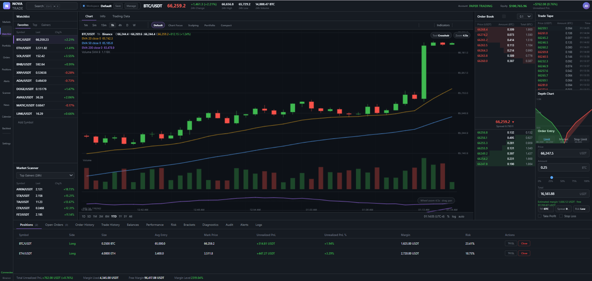
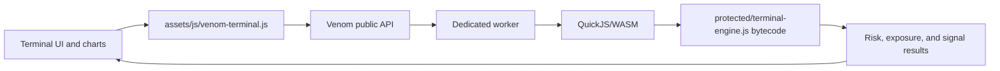

# NOVA TRADE — Protected Trading Terminal




> **Flagship Venom integration example · Paper trading only**

NOVA TRADE is a full browser-native trading terminal that demonstrates how a complex application can keep rendering, charting, events, layout management, market simulation, and user interaction in the browser while moving proprietary risk, portfolio, order-policy, and signal logic into protected QuickJS/WASM execution.

It is intentionally larger than a toy example. The source includes a simulated market feed, advanced order entry, alerts, chart tooling, workspace presets, diagnostics, audit history, risk panels, and paper-trading state.

## What this example proves

- A large multi-file application can be compiled without flattening its browser architecture.
- DOM, canvas/chart, keyboard, layout, and event code can remain browser-native.
- Valuable policy and analytics functions can use a narrow asynchronous protected API.
- Development and production use the same real QuickJS/WASM execution path.
- Production output remains deployable as a normal static website.

## Execution boundary

| Component | Realm | Reason |
|---|---|---|
| Terminal layout and panels | Browser | Direct DOM and UI state |
| Charts and drawing tools | Browser | Canvas/rendering integration |
| Simulated market stream | Browser | UI-facing event source |
| Order entry controls | Browser | Forms and interaction |
| Order risk approval | **Protected QuickJS/WASM** | Proprietary policy logic |
| Portfolio exposure scoring | **Protected QuickJS/WASM** | Valuable analytics |
| Market signal generation | **Protected QuickJS/WASM** | Proprietary algorithm |
| Bridge serialization | Worker boundary | Validated JSON-safe calls |

## Architecture



## Source layout

```text
examples/nova-trade/
├── index.html
├── venom.toml
├── venom.lock
├── protected/
│   └── terminal-engine.js
└── assets/
    ├── css/
    └── js/
        ├── venom-terminal.js
        ├── chart-engine.js
        ├── market-sim.js
        ├── order-entry.js
        ├── paper-trading.js
        ├── risk-dashboard.js
        └── ...
```

## Protected API

The protected engine exposes data-oriented operations for order policy, portfolio analytics, and signal generation. Browser code uses the adapter rather than importing protected implementation details directly.

```javascript
await venom.ready();

const decision = await venom.exports.evaluateOrder({
  symbol: "VENM",
  side: "BUY",
  quantity: 250,
  limitPrice: 182.40,
  portfolio: currentPortfolio
});
```

Bridge values must be JSON-safe. DOM nodes, functions, cyclic structures, and browser handles do not cross the boundary.

## Run in development

From the repository root:

```powershell
venom dev examples\nova-trade --open
```

Development keeps generated runtime code readable and emits diagnostics, but protected logic still executes through the real QuickJS/WASM runtime.

## Build production

```powershell
venom build examples\nova-trade --profile prod --out dist\nova-trade
venom analyze-dist dist\nova-trade
venom release-check dist\nova-trade
```

Serve the generated directory with an ordinary HTTP server. Do not open `index.html` directly from `file://`, because workers and WebAssembly require normal HTTP behavior.

## What to inspect in the distribution

A production build should contain hashed loader, worker, runtime, WASM, stylesheet, and package assets. The proprietary source from `protected/terminal-engine.js` should not appear as ordinary readable browser JavaScript.

Use:

```powershell
venom analyze-dist dist\nova-trade --format json
```

The release checker validates the real engine requirement, runtime/package binding, production policy, and common metadata/source leakage.

## Integration lessons

1. Keep rendering and browser integrations in the browser realm.
2. Protect cohesive algorithms rather than tiny helper calls.
3. Use plain JSON-safe request/response contracts.
4. Batch expensive analytics when possible.
5. Treat the protected boundary like a worker service API.
6. Keep credentials and broker-authoritative decisions on a trusted server.

## Disclaimer

NOVA TRADE is a paper-trading and runtime-integration demonstration. It does not connect to a broker, execute real orders, or provide financial advice.
