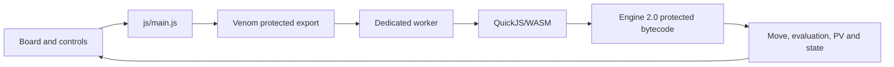

# Protected Chess — Engine 2.0 QuickJS/WASM Example


> **Flagship Venom example · Browser UI with a protected, time-managed chess engine**

Protected Chess keeps board rendering and interaction browser-native while moving chess rules, evaluation, search, move selection, and game-state validation into protected QuickJS bytecode executed inside Venom's worker-hosted WebAssembly runtime.

## Engine 2.0

The example now uses a deterministic, full-board engine rather than an incrementally accumulated browser score.

| Capability | Implementation |
|---|---|
| Score convention | White-positive centipawns |
| Search | Negamax with alpha-beta pruning |
| Time management | Iterative deepening with a hard request budget |
| Tactical stability | Quiescence search for captures, promotions, and check evasions |
| Repeated positions | Persistent canonical-position transposition table |
| Move ordering | TT move, MVV-LVA captures, promotions, killers, and history |
| Evaluation | Tapered king tables, material, PSTs, bishop pair, pawn structure, passed pawns, rook files, king shelter, and tempo |
| Analysis output | Completed depth, nodes, qnodes, TT hits, cutoffs, NPS, and principal variation |
| Bridge efficiency | Optional search-and-play operation returns the move and authoritative updated state in one call |

Search is deterministic for the same position and limits. A time-limited interruption always unwinds every speculative move before returning the last fully completed iteration.

## What is protected

| Component | Realm |
|---|---|
| Board rendering and interaction | Browser |
| Move highlighting and controls | Browser |
| Game state presentation | Browser |
| Chess rules and legal move generation | **Protected QuickJS/WASM** |
| Full-board evaluation and search | **Protected QuickJS/WASM** |
| Browser-to-engine calls | Validated asynchronous bridge |

## Architecture



The browser never supplies an authoritative accumulated score. Every evaluation is derived from the protected board state.

## Run

```powershell
.\scripts\protected-chess.bat
```

Or use the CLI directly:

```powershell
venom dev examples\protected-chess --open
```

## Build production

```powershell
venom build examples\protected-chess --profile prod --out dist\protected-chess
venom analyze-dist dist\protected-chess
venom release-check dist\protected-chess
```

## Source tests

Run the deterministic engine smoke suite without building the browser runtime:

```powershell
.\scripts\test-protected-chess-engine.ps1
```

Include the fixed-position benchmark:

```powershell
.\scripts\test-protected-chess-engine.ps1 -Benchmark -Depth 8 -TimeMs 1500
```

Linux/macOS:

```bash
./scripts/test-protected-chess-engine.sh
DEPTH=8 TIME_MS=1500 ./scripts/test-protected-chess-engine.sh --benchmark
```

The smoke suite covers:

- starting-position perft through depth 4;
- full-board evaluation consistency;
- deterministic principal move selection;
- transposition-table reuse;
- one-call search and move application;
- mate-in-one detection;
- timeout-safe board restoration.

## Protected bridge operations

The protected export accepts coarse-grained operations:

```text
identity
state
moves
evaluate
move
search
perft
```

A search request supports `maxDepth`, `timeMs`, and `play`. With `play: true`, the engine returns the chosen move and updated state in one protected call.

## Why it is a useful security example

A normal JavaScript chess engine exposes its evaluation constants, move ordering, pruning strategy, search implementation, and heuristics directly in browser source. Venom changes that recovery problem: the engine is compiled to QuickJS bytecode, stored in a diversified package, decoded through the runtime boundary, and invoked through opaque production bridge metadata.

This does not make the engine impossible to recover. It forces analysis beyond ordinary source formatting and JavaScript deobfuscation, while per-build diversification reduces the value of one fixed extraction layout.

## Performance measurement

Benchmark reports should include the browser, CPU, position, maximum depth, time budget, build profile, and whether the measurement includes bridge overhead. Warm the worker and protected runtime before comparing repeated calls because the persistent transposition table intentionally accelerates recurring analysis.

## Source layout

```text
examples/protected-chess/
├── index.html
├── css/main.css
├── js/
│   ├── main.js
│   └── ai-engine.js
├── tests/
│   ├── engine-smoke.js
│   └── engine-benchmark.js
├── vendor/
├── venom.browser.json
└── venom.lock
```

## Verification

After a production build, inspect generated JavaScript and confirm that engine evaluation and search logic are not present as readable browser source. Then run `venom release-check` to validate runtime provenance, package binding, release policy, and leakage checks.
