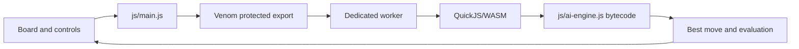

# Protected Chess — QuickJS/WASM Engine Example


> **Flagship Venom example · Browser UI with a protected chess engine**

Protected Chess demonstrates one of Venom's strongest use cases: preserve a responsive browser-native interface while moving valuable search, evaluation, and move-selection logic into protected QuickJS bytecode executed inside the worker-hosted WebAssembly runtime.

## What is protected

| Component | Realm |
|---|---|
| Board rendering and interaction | Browser |
| Move highlighting and controls | Browser |
| Game state presentation | Browser |
| Chess search/evaluation engine | **Protected QuickJS/WASM** |
| Browser-to-engine calls | Validated asynchronous bridge |

## Architecture



## Run

```powershell
venom dev examples\protected-chess --open
```

## Build production

```powershell
venom build examples\protected-chess --profile prod --out dist\protected-chess
venom analyze-dist dist\protected-chess
venom release-check dist\protected-chess
```

## Why it is a useful security example

A normal JavaScript chess engine exposes its evaluation constants, move ordering, pruning strategy, search implementation, and heuristics directly in browser source. Venom changes that recovery problem: the engine is compiled to QuickJS bytecode, stored in a diversified package, decoded through the runtime boundary, and invoked through opaque production bridge metadata.

This does not make the engine impossible to recover. It does force analysis beyond ordinary source formatting and JavaScript deobfuscation, and per-build diversification reduces the usefulness of one fixed extraction layout.

## Performance measurement

Benchmark claims should include the browser, CPU, position, search depth or time limit, build profile, and whether the measurement includes bridge overhead. For meaningful comparisons, warm up the worker/runtime before measuring repeated engine calls.

## Source layout

```text
examples/protected-chess/
├── index.html
├── css/main.css
├── js/
│   ├── main.js
│   └── ai-engine.js
├── vendor/
├── venom.browser.json
└── venom.lock
```

## Integration pattern

Keep board manipulation and DOM work browser-side. Expose coarse engine operations such as choosing a move, evaluating a position, or analyzing a line. Avoid crossing the worker boundary for every tiny engine helper.

## Verification

After a production build, inspect the generated JavaScript and confirm the engine implementation is not present as readable browser source. Then run `venom release-check` to validate runtime provenance, package binding, release policy, and leakage checks.
