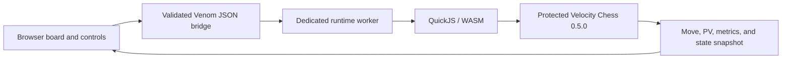

# Protected Chess — Velocity Chess 0.5.0 / QuickJS-WASM


> **Venom Example 1 · Browser UI with the complete Velocity Chess engine protected**

This example integrates **Velocity Chess v0.5.0** into Venom's worker-isolated QuickJS/WASM runtime. The browser receives only a narrow asynchronous bridge. Chess rules, legal-move generation, position mutation, evaluation, hashing, search, move notation, draw detection, and authoritative game-state transitions execute inside the protected export.

## Protected engine pipeline

| Capability | Protected implementation |
|---|---|
| Position state | 64-square typed board, incremental piece lists, side occupancy, castling, en-passant, clocks |
| Move representation | Packed unsigned 32-bit moves |
| Move generation | Piece-list-driven pseudo-legal generation plus make/unmake legality filtering |
| Hashing | Incremental dual-32-bit Zobrist keys |
| Evaluation | Tapered middlegame/endgame material, PST, mobility, and bishop-pair terms |
| Search | Iterative deepening, aspiration windows, PVS alpha-beta, null-move pruning, LMR, check extensions, and quiescence |
| Ordering | Hash move, MVV-LVA captures, killers, and history |
| Cache | Persistent 17-bit typed-array transposition table inside the protected runtime |
| Game state | Check, mate, stalemate, 50-move rule, insufficient material, and threefold repetition |
| Output | SAN/UCI move data, White-positive evaluation, PV, depth, nodes, NPS, TT metrics, and authoritative snapshots |

## Protection boundary



Only `js/main.js`, board rendering, controls, and presentation remain browser-native. `js/ai-engine.js` contains one `@venom: protected isolated` export; Venom extracts the complete embedded engine and replaces the production browser source with protected bridge metadata.

## Run Example 1

Windows:

```powershell
.\scripts\windows\build-and-launch-example1.bat
```

Linux/macOS:

```bash
./scripts/linux/build-and-launch-example1.sh
```

## Build and verify

```bash
venom build examples/protected-chess --profile prod --out dist/protected-chess
venom analyze dist/protected-chess
venom verify dist/protected-chess --target browser
venom verify-runtime dist/protected-chess --require-real-engine
python tools/check_production_leaks.py dist/protected-chess
```

## Source tests

```bash
node examples/protected-chess/tests/engine-smoke.js
node examples/protected-chess/tests/engine-benchmark.js 8 1500
```

The smoke suite validates canonical perft totals, legal moves, FEN round trips, deterministic search, authoritative search-and-play snapshots, mate recognition, draw handling, repetition tracking, and time-bounded root restoration.

## Protected operations

```text
identity
state
moves
evaluate
move
search
perft
```

Search accepts `maxDepth`, `timeMs`, and `play`. `play: true` performs the selected move inside the same protected call and returns the updated state. Browser code never applies or validates an authoritative chess move itself.

## Source provenance

The supplied Velocity Chess v0.5.0 implementation is integrated into the single protected function in `examples/protected-chess/js/ai-engine.js`. No standalone engine module is referenced or copied as a production browser asset.
